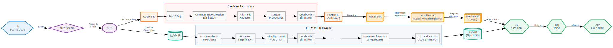

Ola is a toy language with both LLVM backend and a custom backend. 

## Features
  * classes
	- access modifiers: `public`, `private`
	- constructors
	- single inheritance: `:`
	- polymorphism using vtables: `virtual`, `pure`, `final`
	- `interface`, `this` and `super` keywords
  * operators:
    - additive: `+`, `-`, `+=`, `-=`, `++`, `--`
    - multiplicative: `*`, `/`, `%`, `*=`, `/=`, `%=`
    - relation: `==`, `!=`, `>`, `>=`, `<`, `<=`
    - shift: `>>`, `<<`, `>>=`, `<<=`
    - bitwise: `&`, `|`, `^`, `~`, `&=`, `|=`, `^=`
    - logic: `&&`, `||`, `!`
  * control statements: `if` `else`, `switch`, `goto`, `?:`
  * loop statements: `for`,`foreach`, `while`, `do` `while`, `break`, `continue`
  * reference type: `ref`
  * automatic type deduction: `auto`
  * enums
  * functions 
    - overloading
    - attributes: `inline`, `noinline`, `nomangle` (equivalent to C++'s `extern "C"`), `noopt`, `deprecated`
  * arrays
  * misc: `alias`, `sizeof`, `length` operators, strings, floats, implicit casts, scopes, import
  * LLVM backend
  * Custom backend
    - Custom IR
    	- Optimization passes: Function Inlining, Simplify CFG, Mem2Reg, CSE, Arithmetic Reduction, Constant Propagation, LICM, DCE, Global DCE
        - Analysis passes: CFG, Loop, Dominator Tree, Dominator Frontier
    - Custom MIR
      - instruction legalization
      - register allocation
    - x86-64 code generation
    - Class support (wip)
  
## Architecture


## Structure
The project consists of the following parts:
1. **Ola Library**:
   - A standard library for the Ola language, implemented in C and built as a static library to be used by the compiler. It includes essential components like:
     - `olaio.h`, `olamath.h`, `olaassert.h`, `olastring.h`, `olamemory.h`
   
2. **Ola Compiler**:
   - The core of the Ola project, implemented as a **static library** (`OlaCompiler`) with the following components:
     - **Lexer**: Tokenizes the source code.
     - **Import Processor**: Processes `import` statements from the tokenized input.
     - **Parser**: A recursive descent parser that constructs an Abstract Syntax Tree (AST) from processed tokens.
     - **Sema**: Performs semantic analysis on the AST. Runs together with Parser, not as a separate step.
     - **Backend**: After frontend processing, the compilation process diverges into two backend paths:
       - **LLVM**:
         - **LLVMIR Visitor**: Transforms the AST into LLVM IR.
         - **LLVMIR Pass Manager**: Applies LLVM optimization passes to the IR.
         - Compilation to assembly is done using the `clang -S` command.
       - **Custom Backend**:
         - **IR Visitor**: Transforms the AST into Ola's custom IR.
         - **IR Pass Manager**: Applies custom optimization passes at the IR level.
         - **MachineModule**: Responsible for lowering IR to MIR and finally to assembly.

3. **Ola Driver**:
   - An **executable** (`OlaDriver`) that serves as the main entry point for compiling Ola code. It links to the `OlaCompiler` library and calls compiler's API.

4. **Ola Playground**:
   - A separate **executable** that links to the `OlaCompiler` static library. It provides a development environment for experimenting with the compiler and Ola code, without directly invoking the `OlaDriver`.

5. **Ola Tests**:
   - A set of unit tests built with GoogleTest, covering Ola language features. These tests are organized into two main folders:
     - **LLVM Tests**: Unit tests that use the LLVM backend of the compiler.
     - **Custom Backend Tests**: Unit tests that use the custom backend.
     - The tests rely on the `Assert` function from the `std.assert` import.
     - **OlaDriver** executable is used in the tests via system calls.

## Dependencies
* [LLVM 17.0](https://github.com/llvm/llvm-project) for LLVM backend (optional)  
  * _Note: You can disable the LLVM backend even though you might have LLVM 17.0 installed by generating project with `ENABLE_LLVM=OFF`:_  
    ```bash
    cmake -DENABLE_LLVM=OFF -B build
    ```

## Usage
### Command line options
  * `--ast`: Dump AST to output/log
  * `--cfg`: Dump CFGs to .dot files and visualize them
  * `--callgraph`: Dump Call Graphs to .dot files and visualize them
  * `--domtree`: Dump Dominator Trees to .dot files and visualize them
  * `--emit-ir`: Emit IR file
  * `--emit-mir`: Emit IR file
  * `--emit-asm`: Emit ASM file
  * `--domfrontier`: Print dominance frontiers to standard output
  * `--nollvm`: Use custom backend instead of LLVM backend
  * `--test`: Used for running g-tests
  * `--timeout`: Used for detecting infinite loops during tests
  * `--Od`: No optimizations
  * `--O0`: Same as `--Od`
  * `--O1`: Optimize
  * `--O2`: Optimize more
  * `--O3`: Optimize even more
  * `-i` ... : Input files
  * `-o`: Output file
  * `--directory`: Directory of input files
  

## Samples
Currently to see the samples you can check the test folder: `OlaTests/Tests/`.
