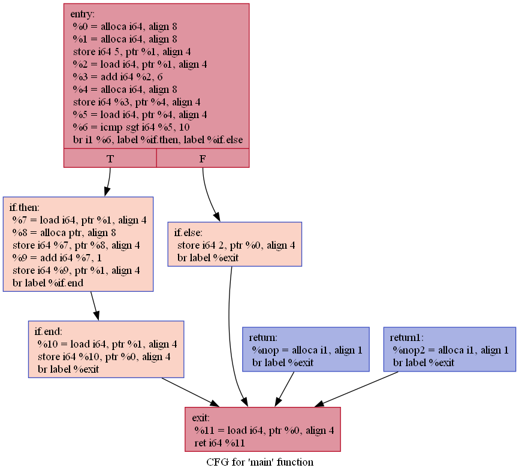
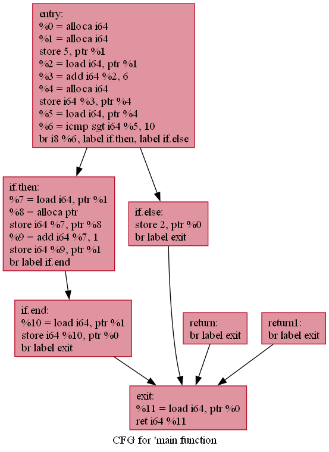
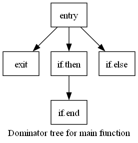

<br/><br/>

# Ola
Ola is a toy programming language designed with a focus on modularity and learning, offering both an LLVM-based backend and a work-in-progress custom backend. 

## Dependencies
  * [LLVM 17.0.1](https://github.com/llvm/llvm-project) for compiler backend.

## Features
  * classes
	- access modifiers: `public`, `private`
	- constructors
	- single inheritance: `:`
	- polymorphism using vtables: `virtual`, `pure`, `final`
	- `this` and `super` keywords
  * reference type: `ref`
  * automatic type deduction: `auto`
  * operators:
    - additive: `+`, `-`, `+=`, `-=`, `++`, `--`
    - multiplicative: `*`, `/`, `%`, `*=`, `/=`, `%=`
    - relation: `==`, `!=`, `>`, `>=`, `<`, `<=`
    - shift: `>>`, `<<`, `>>=`, `<<=`
    - bitwise: `&`, `|`, `^`, `~`, `&=`, `|=`, `^=`
    - logic: `&&`, `||`, `!`
  * control statements: `if` `else`, `switch`, `goto`, `?:`
  * loop statements: `for`,`foreach`, `while`, `do` `while`, `break`, `continue`
  * enums
  * functions 
    - overloading
	- attributes: `inline`, `noinline`, `nomangling` (equivalent to C++'s `extern "C"`)
  * arrays
  * `sizeof`, `length` operators
  * `alias`
  * strings
  * floats 
  * implicit casts
  * scopes
  * import statement
  * standard library
  * Backend architecture
	- LLVM Backend: Emits LLVM IR and supports LLVM optimization passes.
	- Custom Backend (Work in Progress):
		- Custom Intermediate Representation (IR) and Machine Intermediate Representation (MIR).
		- IR optimization passes
		- Early support for x86-64 code generation.
		- Missing features: proper stack layout and class support.

## Structure
Ola consists of the following parts:

1. **Ola Library**:
   - A standard library for the Ola language, implemented in C and built as a static library to be used by the compiler. It includes essential components like:
     - `olaio.h`, `olamath.h`, `olaassert.h`, `olastring.h`, `olamemory.h`
   
2. **Ola Compiler**:
   - The core of the Ola project, implemented as a **static library** (`OlaCompiler`) with the following components:
     - **Lexer**: Tokenizes the source code.
     - **Import Processor**: Processes `import` statements from the tokenized input.
     - **Parser**: A recursive descent parser that constructs an Abstract Syntax Tree (AST) from processed tokens.
     - **Sema**: Performs semantic analysis on the AST to ensure code correctness.
     - **Backend**: After frontend processing, the compilation process diverges into two backend paths:
       - **LLVM Path**:
         - **LLVM Visitor**: Transforms the AST into LLVM IR.
         - **LLVM Optimizer**: Applies LLVM optimization passes to the IR, based on the specified optimization level.
         - Compilation to assembly is done using the `clang -S` command.
       - **Custom Backend Path**:
         - **IRVisitor**: Transforms the AST into Ola's custom IR.
         - **IROptimizer**: Applies custom optimizations at the IR level.
         - **MachineModule**: Responsible for lowering IR to MIR and finally to assembly.

3. **Ola Driver**:
   - An **executable** (`OlaDriver`) that serves as the main entry point for compiling Ola code. It links to the `OlaCompiler` library and calls compiler's API, handling the entire compilation pipeline.

4. **Ola Playground**:
   - A separate **executable** that links to the `OlaCompiler` static library. It provides a development environment for experimenting with the compiler and Ola code, without directly invoking the `OlaDriver`.

5. **Ola Tests**:
   - A set of unit tests built with GoogleTest, covering Ola language features. These tests are organized into two main folders:
     - **LLVM Tests**: Unit tests that use the LLVM backend of the compiler.
     - **Custom Backend Tests**: Unit tests that use the custom backend.
     - The tests rely on the `Assert` function from the `std.assert` import.
     - **OlaDriver** executable is used in the tests via system calls, allowing the tests to invoke the compiled executable to verify correct behavior.

## Usage
### Command line options
  * `--ast`: Dump AST to output/log
  * `--cfg`: Dump CFGs to .dot files and visualize them
  * `--callgraph`: Dump Call Graphs to .dot files and visualize them
  * `--domtree`: Dump Dominator Trees to .dot files and visualize them
  * `--emit-ir`: Emit (i.e. don't delete) IR file
  * `--emit-asm`: Emit (i.e. don't delete) ASM file
  * `--nollvm`: Use custom backend instead of LLVM backend
  * `--test`: Used for running g-tests
  * `--Od`: No optimizations
  * `--O0`: Same as `--Od`
  * `--O1`: Optimize
  * `--O2`: Optimize more
  * `--O3`: Optimize even more
  * `-i` ... : Input files
  * `-o`     : Output file
  * `--directory`: Directory of input files
  
## CFG example
```cpp
public int main()
{
    int a = 5;
    int b = a + 6;
    if(b > 10)
    {
        a++;
    }
    else
    {
        return 2;
    }
    return a;
}
```
CFG visualization for the code above using `--cfg` (without optimizations):
### CFG visualization (LLVM backend)


### CFG visualization (Custom backend)


Dominator Tree visualization for the code above using `--domtree` (more or less the same in both backends):
### Dominator Tree visualization (Custom backend)


## Samples
Currently to see the samples you can check the test folder: `OlaTests/Tests/`.

